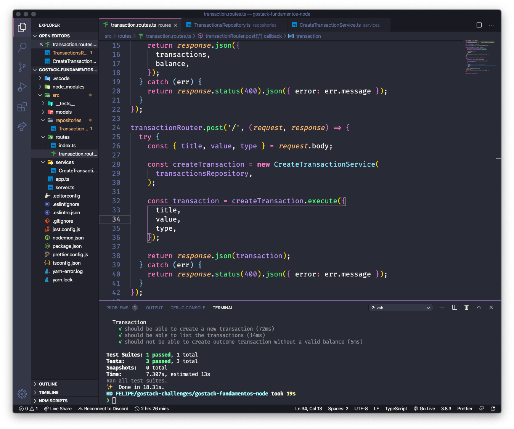

<h3 align="center">
  Desafio: Fudamentos de Node.js
</h3>

<p align="center">“Aprendizado é um processo e você não vai ser um expert em uma semana.” by Diego Fernandes</blockquote>

<p align="center">
  <a href="#rocket-sobre-o-desafio">Sobre o desafio</a>&nbsp;&nbsp;&nbsp;|&nbsp;&nbsp;&nbsp;
  <a href="#preview">Preview</a>&nbsp;&nbsp;&nbsp;|&nbsp;&nbsp;&nbsp;
  <a href="#licença">Licença</a>
</p>

## Sobre o desafio

POST /transactions: A rota deve receber title, value e type dentro do corpo da requisição, sendo type o tipo da transação, que deve ser income para entradas (depósitos) e outcome para saídas (retiradas). Ao cadastrar uma nova transação, ela deve ser armazenada dentro de um objeto com o seguinte formato :
```
 {
  "id": "uuid",
  "title": "Salário",
  "value": 3000,
  "type": "income"
}
```
GET /transactions: Essa rota deve retornar uma listagem com todas as transações que você cadastrou até agora, junto com o valor de soma de entradas, retiradas e total de crédito. Essa rota deve retornar um objeto com o formato a seguir:
```
{
  "transactions": [
    {
      "id": "uuid",
      "title": "Salário",
      "value": 4000,
      "type": "income"
    },
    {
      "id": "uuid",
      "title": "Freela",
      "value": 2000,
      "type": "income"
    }
  ],
  "balance": {
    "income": 6000,
    "outcome": 5200,
    "total": 800
  }
}
```
Acesse a pasta criada e abra no Visual Studio Code, lembre-se de executar o comando `yarn` no seu terminal para instalar todas as dependências.

## Preview

<p align="center">
  
</p>

<p align="center">
  
</p>

## Licença

Esse projeto está sob a licença MIT. [LICENSE](license.md)

---

Feito com ❣️ by Felipe Machado
